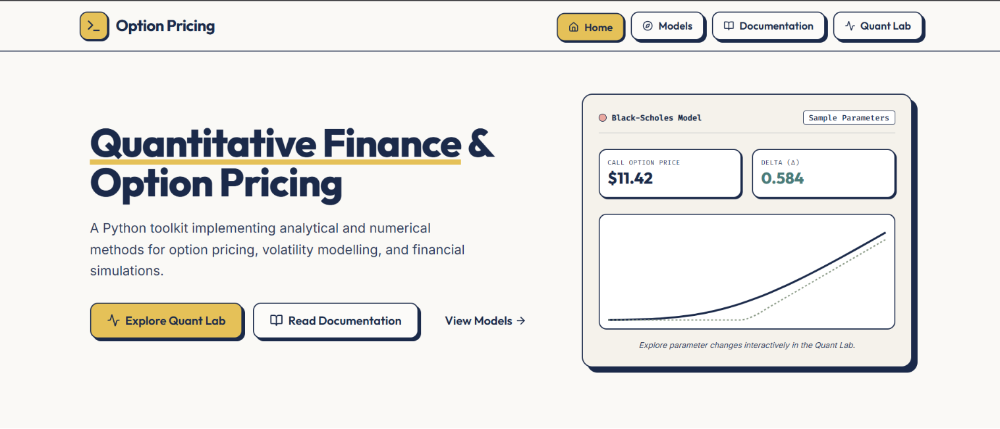
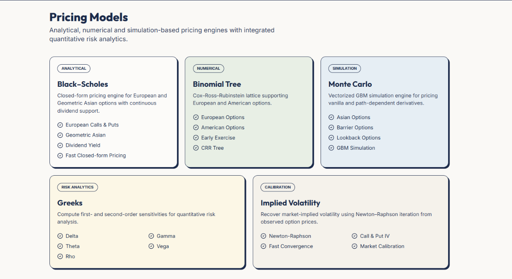
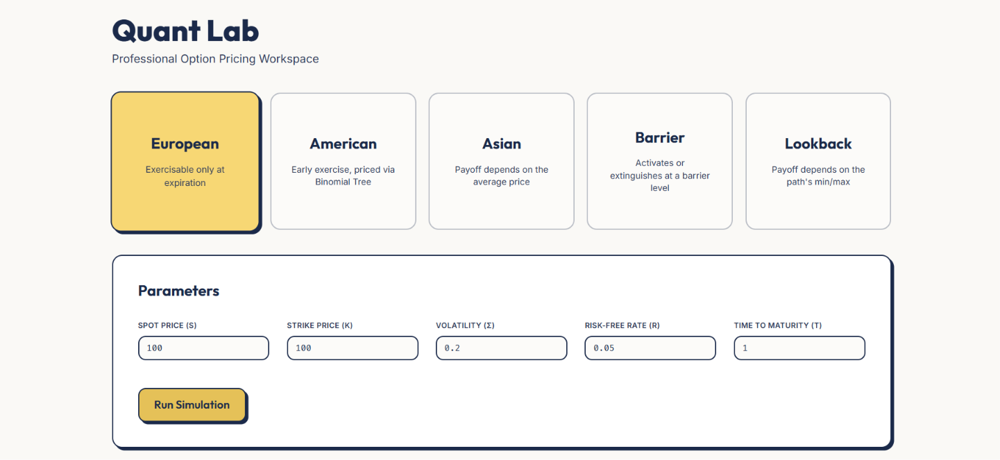
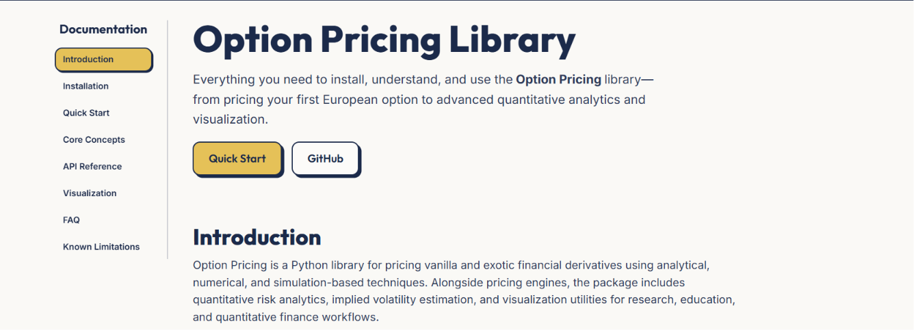

# Option Pricing Portal

[](#)
[](#)
[](#)
[](#)

**Live Demo** | `https://option-pricing-portal.vercel.app/`  
**Backend API** | `https://lightbender62--option-pricing-portal-fastapi-app.modal.run`  
**Option Pricing Library** | `<https://github.com/lightbender62/Option-pricing>`

Option Pricing Portal is the official browser-based interface for the **Option Pricing** Python library. It provides an interactive environment for pricing financial derivatives, visualizing results, and exploring quantitative finance workflows without writing Python code.

All quantitative computations are performed by the companion **Option Pricing** package. This repository focuses on the web application, REST API, deployment, and user experience.

---

## Table of Contents

- Why Option Pricing Portal?
- Features
- Companion Python Library
- Architecture
- Tech Stack
- Screenshots
- Live Application
- Local Development
- Environment Variables
- Project Structure
- REST API Overview
- Deployment

---

## Why Option Pricing Portal?

The Option Pricing library exposes a comprehensive collection of quantitative finance models through Python. This portal extends the library with an interactive web interface so that users can explore pricing models, compare results, and visualize outputs directly from the browser.

The React frontend communicates with the FastAPI backend through REST endpoints. The backend validates requests and delegates every pricing operation to the **Option Pricing** Python library.

---

## Features

### Pricing

- European Options
- American Options
- Asian Options
- Barrier Options
- Lookback Options

### Pricing Engines

- Black–Scholes
- Binomial Tree
- Monte Carlo

### Analytics

- Greeks
- Implied Volatility

### Interactive Visualizations

- Payoff diagrams
- Monte Carlo stock paths
- Terminal price distributions
- Price heatmaps
- Greeks profiles
- Pricing curves
- Monte Carlo convergence
- Binomial convergence
- Volatility smiles
- Volatility surfaces

### Additional Resources

- Documentation
- Theory Notes
- Interactive Quant Lab
- FastAPI Swagger UI

---

## Companion Python Library

The portal is built on top of the **Option Pricing** Python package.

| Repository | Responsibility |
|------------|----------------|
| Option Pricing | Pricing algorithms, numerical methods, Greeks, implied volatility, visualization utilities |
| Option Pricing Portal | React frontend, FastAPI backend, REST API, deployment, interactive UI |

Mathematical models and implementation details are documented in the companion library and are intentionally not duplicated here.

---

## Architecture

```text
                    User
                      │
                      ▼
          React + TypeScript Frontend
               (Hosted on Vercel)
                      │
              HTTPS REST Endpoints
                      │
                      ▼
                FastAPI Backend
                (Hosted on Modal)
                      │
         Request Validation (Pydantic)
                      │
                      ▼
         Option Pricing Python Library
      Black-Scholes • Binomial • Monte Carlo
     Greeks • IV • Visualization Utilities
                      │
               Computation Results
                      │
                      ▼
                 JSON Responses
                      │
                      ▼
     Charts • Tables • Interactive Interface
```

---

## Tech Stack

| Layer | Technologies |
|------|--------------|
| Frontend | React, TypeScript, Tailwind CSS, Framer Motion |
| Backend | FastAPI, Pydantic, Uvicorn |
| Quantitative Engine | Option Pricing (Python) |
| Deployment | Vercel, Modal |

---

## Screenshots

### Home



### Pricing Models



### Quant Lab



### Documentation



---

## Live Application

| Service | Link |
|---------|------|
| Portal | `https://option-pricing-portal.vercel.app/` |
| Backend API | `https://lightbender62--option-pricing-portal-fastapi-app.modal.run`  |
| Swagger | `https://lightbender62--option-pricing-portal-fastapi-app.modal.run/docs` |
| Option Pricing Library | `https://github.com/lightbender62/Option-pricing` |

---

## Local Development

### Backend

```bash
cd backend
python -m venv .venv
source .venv/bin/activate   # Windows: .venv\Scripts\activate
pip install -r requirements.txt
uvicorn main:app --reload
```

### Frontend

```bash
cd frontend
npm install
npm run dev
```

---

## Environment Variables

### Frontend

| Variable | Required | Description |
|----------|----------|-------------|
| `VITE_API_URL` | Yes | Base URL of the FastAPI backend |

### Backend

| Variable | Required | Description |
|----------|----------|-------------|
| `CORS_ORIGINS` | Yes | Allowed frontend origins |

---

## Project Structure

```text
option-pricing-portal/
├── backend/
│   ├── routers/
│   ├── schemas/
│   ├── services/
│   └── main.py
├── frontend/
│   ├── src/
│   │   ├── components/
│   │   ├── pages/
│   │   ├── hooks/
│   │   ├── assets/
│   │   └── lib/
│   └── public/
├── images/
├── README.md
└── ...
```

---

## REST API Overview

| Method | Endpoint | Purpose |
|--------|----------|---------|
| POST | `/price/black-scholes` | Black–Scholes pricing |
| POST | `/price/binomial` | Binomial Tree pricing |
| POST | `/price/monte-carlo` | Monte Carlo pricing |
| POST | `/greeks` | Compute Greeks |
| POST | `/implied-volatility` | Estimate implied volatility |
| GET | `/docs` | Swagger UI |
| GET | `/openapi.json` | OpenAPI schema |
| GET | `/health` | Health check |

---

## Deployment

The frontend is deployed on **Vercel**, while the FastAPI backend is deployed independently on **Modal**.

This separation allows the frontend to remain a lightweight client that communicates with the backend over HTTPS REST endpoints. The backend serves as a thin API layer around the **Option Pricing** Python library, which performs all quantitative computations.
